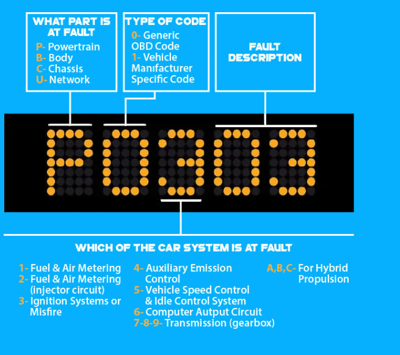
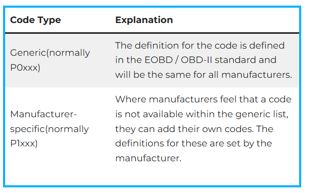
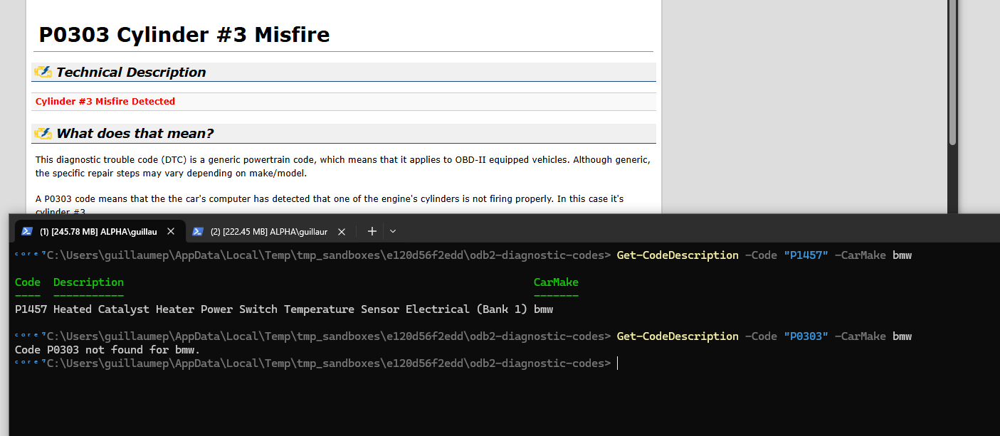

<center></center>

## What's This ?

It's my lazy attempt at setting up a database containing all the possible ODB2 diagnostic codes.

## What is a Diagnostic Trouble Code (DTC)?

Diagnostic trouble codes, in broad terms, are codes that computer diagnostic system in a given car has. The system displays a certain code depending on what kind of problem that the system can detect from inside of a car.
Diagnostic trouble costs are used to help car mechanics and owners with a rich expertise in car maintenance understand problems with the car and where the root of the car’s problem or problems may lie.
These codes must be used along with the car’s manual to determine what needs to be examined and tested to properly diagnose a car’s problem whether from professional OBD 2 software or with a car code reader.


## Explication of Diagnostic Codes

DTCs come in a string of five characters. One code for example, might be “P0806”.

<center></center>

The first character will either be P (powertrain), B (Body-AC/Airbag), C (chassis-ABS) or U (network-CAN/BUS). This character will help you determine which of the four main car’s parts is at fault.

The second character either will be a 0 or 1. 0 means it is a generic OBD 2 code. 1 means it is a car manufacturer exclusive code.

The third character can be one of many letters or numbers. This list of characters include 1 (fuel and air metering), 2 (fuel and air metering-injector circuit), 3 (ignition system or misfire), 4 (auxiliary emission control), 5 (vehicle speed and idle control systems), 6 (computer autput circuit), 7,8 or 9 (transmission) and A, B or C (hybrid propulsion).

The fourth and fifth characters in the code represent a specific description of the problem with the part and system in question. These are numbered by “00”, “01”, “02” and so on.

In total, there are over 5000 generic and manufacturer exclusive OBD 2 troubleshooting codes that exist. You can refer to our master list of DTCs to help you best understand your specific car problem based on your code.


## Difference Between Generic & Manufacturer Specific…

As explained earlier, general DTCs start with P0XXX, and manufacturer exclusive DTCs start with P1XXX. Generic DTCs are defined in the standards for OBD 2 and EOBD 2, and applies to all official car manufacturers.

Manufacturer exclusive DTCs, however, are not available in the generic code databases, and are instead created and defined by a car manufacturer for all the cars they make.

<center></center>

| **Powertrain Codes** |        **TYPE**        |
|:--------------------:|:----------------------:|
|         P0xxx        |         Generic        |
|         P1xxx        | Manufacturer -specific |
|         P0xxx        |         Generic        |
|      P30xx-P33xx     | Manufacturer -specific |
|      P34xx-P39xx     |         Generic        |

| **Chassis Codes** |        **TYPE**        |
|:-----------------:|:----------------------:|
|       C0xxx       |         Generic        |
|       C1xxx       | Manufacturer -specific |
|       C2xxx       | Manufacturer -specific |
|       C3xxx       |         Generic        |


| **Body Codes** |        **TYPE**        |
|:--------------:|:----------------------:|
|     B0xxx      |         Generic        |
|     B1xxx      | Manufacturer -specific |
|     B2xxx      | Manufacturer -specific |
|     B30xx      |         Generic        |


| **Network Communication codes** |        **TYPE**        |
|:-------------------------------:|:----------------------:|
|              U0xxx              |         Generic        |
|              U1xxx              | Manufacturer -specific |
|              U1xxx              | Manufacturer -specific |
|              U0xxx              |         Generic        |


## Resources

 I have found the following online resources for codes

1. [obd2pros](https://obd2pros.com/dtc-codes)
2. [obd-codes.com](https://www.obd-codes.com/trouble_codes/)
3. [Kelly's Blue Book](https://www.kbb.com/obd-ii/)


## Resolving Codes

So I will write PowerShell Scripts to parse web pages, and fetwch the code and it's description base of what you enter.
Maybe I'll generate a SQLite Database as well....

To be COndinued...


## P1*** Manufacturer Specific Trouble Codes

P1*** Manufacturer Specific Trouble Codes If your DTC (diagnostic trouble code) begins with **P1**\_\_\_, that means it's a manufacturer specific code. For more information on P1 codes, choose your vehicle make below: 

- [Acura](https://www.obd-codes.com/trouble_codes/acura/)
- [Audi](https://www.obd-codes.com/trouble_codes/audi/)
- [BMW](https://www.obd-codes.com/trouble_codes/bmw/)
- [Chevrolet](https://www.obd-codes.com/trouble_codes/chevrolet/)
- [Chrysler Dodge Jeep](https://www.obd-codes.com/trouble_codes/dodge/)
- [Ford](https://www.obd-codes.com/trouble_codes/ford/)
- [Honda](https://www.obd-codes.com/trouble_codes/honda/)
- [Hyundai](https://www.obd-codes.com/trouble_codes/hyundai/)
- [Infiniti](https://www.obd-codes.com/trouble_codes/infiniti/)
- [Isuzu](https://www.obd-codes.com/trouble_codes/isuzu/)
- [Jaguar](https://www.obd-codes.com/trouble_codes/jaguar/)
- [Kia](https://www.obd-codes.com/trouble_codes/kia/)
- [Land](https://www.obd-codes.com/trouble_codes/land/)
- [Rover](https://www.obd-codes.com/trouble_codes/rover/)
- [Lexus](https://www.obd-codes.com/trouble_codes/lexus/)
- [Mazda](https://www.obd-codes.com/trouble_codes/mazda/)
- [Mitsubishi](https://www.obd-codes.com/trouble_codes/mitsubishi/)
- [Nissan](https://www.obd-codes.com/trouble_codes/nissan/)
- [Subaru](https://www.obd-codes.com/trouble_codes/subaru/)
- [Toyota](https://www.obd-codes.com/trouble_codes/toyota/)
- [VW](https://www.obd-codes.com/trouble_codes/vw/)


Read more at: https://www.obd-codes.com/trouble_codes/
Copyright OBD-Codes.com


## Scripts


### Get-ManufacturerSpecificCodes

Will load a page in the manufacturer's specific list, for example, [bmw](https://www.obd-codes.com/trouble_codes/bmw/), download the page, parse it and export the codes to JSON format.

```powershell
> . .\scripts\GetCodes\Get-ManufacturerCodes.ps1
> Get-ManufacturerSpecificCodes -CarMake audi

Code  Description
----  -----------
P1101 O2 Sensor Circ.,Bank1-Sensor1Voltage too Low/Air Leak
P1102 O2 Sensor Heating Circ.,Bank1-Sensor1 Short to B+
P1103 O2 Sensor Heating Circ.,Bank1-Sensor1 Output too Low
...

```


### Export-ManufacturerSpecificCodesJson

Will Export all the specific codes for all manufacturers, in a list of Json files. See the files [here](data/ManufacturerSpecificCodes). For Example [bmw.json](data/ManufacturerSpecificCodes/bmw.json)


```powershell
> . .\scripts\GetCodes\Get-ManufacturerCodes.ps1
> Export-ManufacturerSpecificCodesJson
Wrote acura.json
Wrote audi.json
Wrote bmw.json
Wrote chevrolet.json
Wrote dodge.json
...

ls ManufacturerSpecificCodes

Mode                 LastWriteTime         Length Name
----                 -------------         ------ ----
-a---           5/29/2025 12:17 AM           4459 acura.json
-a---           5/29/2025 12:17 AM          58327 audi.json
-a---           5/29/2025 12:17 AM          26646 bmw.json
-a---           5/29/2025 12:17 AM              6 chrysler.json
-a---           5/29/2025 12:17 AM           8176 dodge.json
-a---           5/29/2025 12:17 AM          19469 ford.json
-a---           5/29/2025 12:17 AM           6681 honda.json
-a---           5/29/2025 12:17 AM          12856 hyundai.json
-a---           5/29/2025 12:17 AM           3243 infiniti.json
-a---           5/29/2025 12:17 AM           5176 isuzu.json
-a---           5/29/2025 12:17 AM              6 jeep.json
-a---           5/29/2025 12:17 AM           4378 kia.json
-a---           5/29/2025 12:17 AM              6 land.json
-a---           5/29/2025 12:17 AM           5248 lexus.json
-a---           5/29/2025 12:17 AM           1048 mitsubishi.json
-a---           5/29/2025 12:17 AM           2908 nissan.json
-a---           5/29/2025 12:17 AM              6 rover.json
-a---           5/29/2025 12:17 AM           3737 toyota.json
-a---           5/29/2025 12:17 AM              6 vw.json

```

### Get-CodeDescription


```
> Get-CodeDescription -Code "P1457" -CarMake bmw

Code  Description                                                                CarMake
----  -----------                                                                -------
P1457 Heated Catalyst Heater Power Switch Temperature Sensor Electrical (Bank 1) bmw
```

If it doesn't exists in the Manufacturere Specific COdes (Generic Code), it will open a web page:

<center></center>
